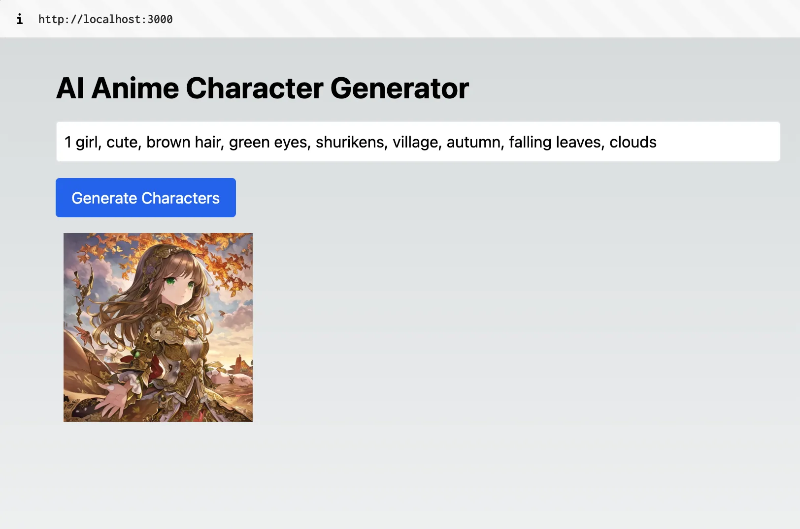

# AI_Anime

# **How to Build an AI Anime Character generator using Next.js and Replicate**

Anime characters have captivated audiences worldwide with their unique and imaginative designs. With the power of artificial intelligence (AI), we can now generate high-quality, detailed anime-style characters with just a few prompts. In this tutorial, we'll explore how to create an AI anime character generator using Next.js, a popular React framework for server-side rendering, and Replicate, a platform that provides access to pre-trained AI models.

## **Prerequisites**

To follow along with this tutorial, you should have the following prerequisites:

1. Node.js and npm (Node Package Manager) installed on your machine.
2. Basic knowledge of JavaScript and React.
3. An active Replicate account and an API token. If you don't have one, you can sign up for an account on the [Replicate website](https://replicate.com/facebookresearch/musicgen).

## **Setting Up the Next.js Project**

Let's start by setting up a new Next.js project. Open your terminal and execute the following commands:

```bash
npx create-next-app ai-anime-generator

✔ Would you like to use TypeScript with this project? … No
✔ Would you like to use ESLint with this project? … Yes
✔ Would you like to use Tailwind CSS with this project? … Yes
✔ Would you like to use `src/` directory with this project? … Yes
✔ Use App Router (recommended)? … No
✔ Would you like to customize the default import alias? … No
```

This will create a new Next.js project in a directory named **`ai-anime-generator`**. Next, open the project in your preferred code editor.

```bash
cd ai-anime-generator
```

## **Installing Dependencies**

Next, we need to install the required dependencies for our project. In the terminal, navigate to the project directory and run the following command:

```bash
npm install replicate
```

Now, create a new file called **`.env`** in the root of your project and add the following environment variables:

```sql
REPLICATE_API_TOKEN=<paste-your-token-here>
```

Retrieve your API token from your [Replicate account settings](https://replicate.com/account/api-tokens).

## **Creating the Backend**

In your project, create a new file called **`anime-character-generator.js`** inside the **`src/pages/api`** directory. This file will contain the code to generate anime characters using the Replicate API.

Add the following code to **`anime-character-generator.js`**:

```jsx
import Replicate from "replicate";

export default async function handler(req, res) {
  const replicate = new Replicate({
    auth: process.env.REPLICATE_API_TOKEN,
  });

  const { prompt } = req.body;

  try {
    const output = await replicate.run(
      "cjwbw/anything-v3-better-vae:09a5805203f4c12da649ec1923bb7729517ca25fcac790e640eaa9ed66573b65",
      {
        input: {
          prompt: `masterpiece, best quality, illustration, beautiful detailed, finely detailed, dramatic light, intricate details, ${prompt}`,
        },
      }
    );

    res.status(200).json({ characters: output });
  } catch (error) {
    console.error("AI anime character generation failed:", error);
    res.status(500).json({ error: "AI anime character generation failed" });
  }
}
```

The code sets up a handler function that initializes the Replicate client using your API token. It then calls the **`run`** method to generate anime characters based on the text prompt provided in the request body.

If the generation is successful, the generated character URLs are returned as a response. Otherwise, an error message is returned.

Link to the model - [Replicate](https://replicate.com/cjwbw/anything-v3-better-vae)

## **Creating the Frontend**

Next, let's create a frontend interface to interact with our AI anime character generator. Open the **`src/pages/index.js`** file and replace its content with the following code:

```jsx
import { useState } from "react";

export default function Home() {
  const [prompt, setPrompt] = useState("");
  const [characters, setCharacters] = useState([]);
  const [loading, setLoading] = useState(false);

  const generateCharacters = async () => {
    try {
        setLoading(true);
      const response = await fetch("/api/anime-character-generator", {
        method: "POST",
        headers: {
          "Content-Type": "application/json",
        },
        body: JSON.stringify({ prompt }),
      });

      const { characters } = await response.json();
      console.log("characters ", characters);
      setCharacters(characters);
    } catch (error) {
      console.error("Failed to generate anime characters:", error);
    } finally {
        setLoading(false);
    }
  };

  return (
    <div className="container mx-auto px-4 py-8 min-h-screen">
      <h1 className="text-3xl font-bold mb-4">AI Anime Character Generator</h1>
      <input
        type="text"
        placeholder="Enter your character prompt..."
        className="text-black border p-2 rounded w-full mb-4"
        value={prompt}
        onChange={(e) => setPrompt(e.target.value)}
      />
      <button
        onClick={generateCharacters}
        className="bg-blue-600 text-white px-4 py-2 rounded"
        disabled={loading}
      >
        {
            loading ? "Generating..." : "Generate Characters"
        }
      </button>
      {characters.length > 0 && (
        <div className="mt-4">
          {characters.map((character, index) => (
            
          ))}
        </div>
      )}
    </div>
  );
}
```

This code sets up a basic React component for the homepage. It includes an input field for the user to enter the text prompt for the anime character and a button to trigger the character generation. The generated anime characters are displayed below the button.

When the "Generate Characters" button is clicked, a request is sent to the **`/api/anime-character-generator`** endpoint we created earlier, passing the text prompt in the request body. If the request is successful, the generated character URLs are set in the component's state, and the characters are displayed as images on the page.

## **Starting the Development Server**

With the code in place, start the Next.js development server by running the following command in your terminal:

```bash
npm run dev
```

Once the server starts, open your browser and navigate to **`http://localhost:3000`**. You should see the "AI Anime Character Generator" heading, an input field, and a button.

Enter a text prompt in the input field, such as "powerful warrior" or "mysterious sorceress," and click the "Generate Characters" button. After a short delay, the generated anime characters will be displayed as images on the page.

**Example prompts:** 

1. **1 boy, ripped body muscles, yellow pointy hair, katana, big eyes, snowclad mountains**
2. **1 girl, cute, brown hair, green eyes, shurikens, village, autumn, falling leaves, clouds**

Congratulations! You have successfully built an AI anime character generator using Next.js and Replicate.



## **Conclusion**

In this tutorial, we explored how to build an AI anime character generator using Next.js and Replicate. We learned how to authenticate with the Replicate API, generate anime characters using text prompts, and integrate the character generator into a Next.js application.

With this foundation, you can unleash your creativity and generate a vast array of anime characters by providing different prompts. Whether you need a valiant hero, a mischievous sidekick, or a mysterious antagonist, the AI anime character generator has you covered. Have fun exploring the endless possibilities of anime character creation! Happy coding!
